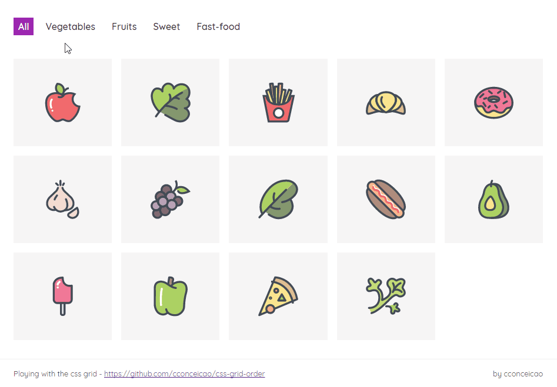

<h2 align="center">CSS grid order example</h2>

In this experiment, the sorting of the items is done with JS and the CSS Grid order property.
First, with JS we get the items of the selected food type (through the data-food attribute). Then we apply the order property to those items (through style property), to reorganize them.

## Icons
source: <a href="https://www.iconfinder.com/iconsets/food-set-3">BomSymbols</a>

